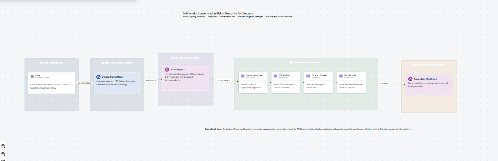
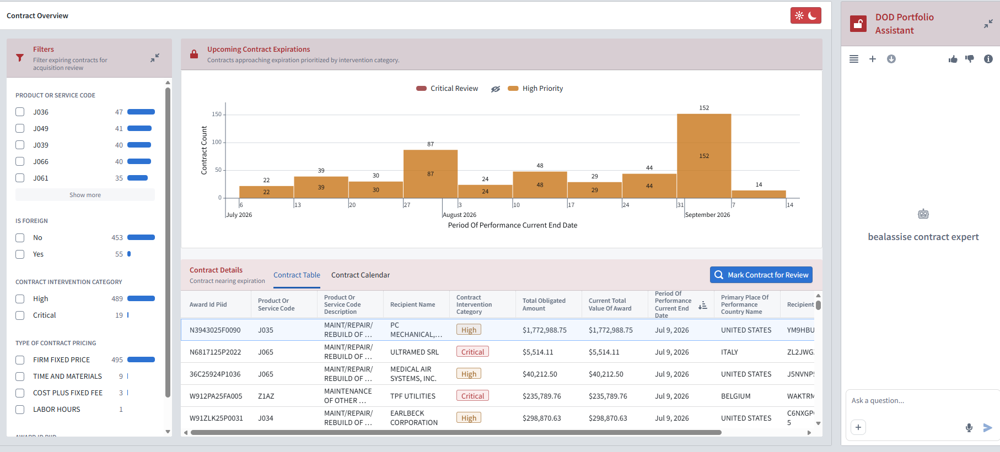
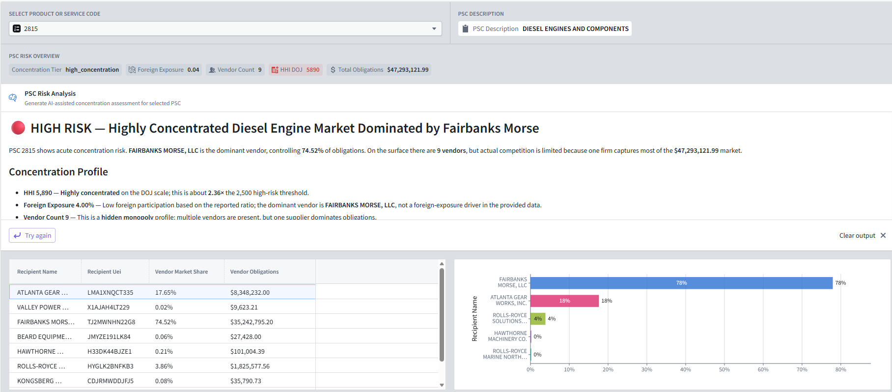
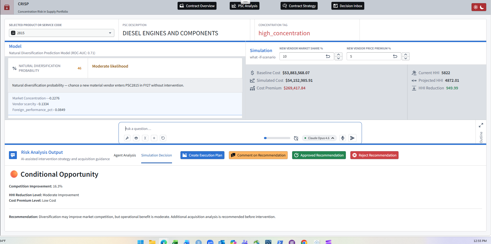
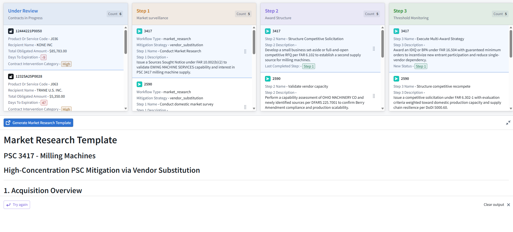

# CRISP
## Concentration Risk in Supply Portfolio

AI-powered decision intelligence platform built in Palantir Foundry to help Department of Defense contracting officers identify supplier concentration risk, evaluate acquisition strategies, and strengthen industrial base resilience.

**Technology Stack**

Palantir Foundry • Workshop • Ontology • Pipeline Builder • AIP • Python • SQL • XGBoost

---

# Executive Summary

CRISP (Concentration Risk in Supply Portfolio) is an AI-powered decision intelligence platform developed in Palantir Foundry to support acquisition planning through supplier concentration analytics, predictive modeling, and AI-assisted recommendations.

Rather than reviewing contracts individually, CRISP evaluates supplier markets at the Product Service Code (PSC) level, enabling contracting officers to identify concentration risk, assess market conditions, simulate acquisition strategies, and manage mitigation workflows within a unified operational environment.

---

# Problem Statement

Traditional procurement systems provide visibility into individual contracts but limited insight into supplier concentration across an entire market.

This visibility gap is documented in **GAO-25-107283 (July 2025)**, which found that DoD supply chain visibility efforts remain fragmented and provide limited insight into supplier markets.

As a result, contracting officers may overlook excessive vendor dependency, declining competition, or foreign exposure until acquisition options become constrained.

CRISP addresses this challenge by integrating procurement data, analytics, machine learning, and AI-assisted decision support into a single operational workflow.

---

# Key Capabilities

- Analyzed 27,000+ contract records spanning **FY2020–FY2025**
- PSC-level concentration analysis using the Herfindahl–Hirschman Index (HHI)
- XGBoost market-entry prediction model (ROC-AUC: **0.71**)
- AI-assisted acquisition strategy recommendations
- Human-in-the-loop decision support workflow

---

# Executive Architecture

The platform transforms public procurement data into operational acquisition intelligence.



---

# Application Workflow

CRISP guides contracting officers through four operational stages.

## 1. Contract Overview

Monitor upcoming contract expirations, prioritize acquisition reviews, and identify contracts requiring intervention.



---

## 2. PSC Analysis

Analyze supplier concentration, vendor market share, foreign exposure, and AI-generated concentration assessments for individual Product Service Codes.



---

## 3. Contract Strategy

Evaluate acquisition strategies through an interactive **what-if simulation** that estimates projected HHI reduction, vendor market share, cost premium, and AI-assisted recommendations before acquisition execution.



---

## 4. Decision Inbox

Track mitigation activities, acquisition workflows, execution progress, and AI-assisted market research documentation.



---

# Machine Learning

CRISP incorporates an XGBoost classification model that estimates the probability a PSC market will naturally attract additional vendors.

## Model Features

- Herfindahl–Hirschman Index (HHI)
- Vendor Count
- Total Obligations
- Historical Procurement Activity

## Performance

- ROC-AUC: **0.71**
- Top predictive features (SHAP): **Vendor Count** and **Herfindahl–Hirschman Index (HHI)**

The XGBoost model estimates the probability of natural market diversification, while the interactive **what-if simulation** enables contracting officers to evaluate acquisition strategies before execution.

Machine learning recommendations augment—not replace—contracting officer judgment.

---

# Technology Stack

| Category | Technologies |
|-----------|--------------|
| Platform | Palantir Foundry |
| Applications | Workshop |
| Data Modeling | Ontology |
| Data Engineering | Pipeline Builder |
| AI | AIP |
| Programming | Python, SQL |
| Machine Learning | XGBoost |

---

# Repository Structure

```text
docs/
├── project_overview.md
└── machine_learning.md

screenshots/
├── contract_overview.png
├── psc_analysis.png
├── contract_strategy.png
└── decision_inbox.png

README.md
architecture.md
crisp_executive_architecture.png
LICENSE
```

---

# Public Repository Notice

This repository is intended as a professional portfolio demonstrating solution architecture, analytics engineering, machine learning, and AI decision support concepts.

No proprietary Palantir Foundry assets, internal ontology exports, confidential pipelines, or government-sensitive data are included. All examples are based on publicly available information, synthetic data, or high-level architectural documentation.

---

# Future Enhancements

- Supply chain resilience scoring
- Additional predictive models
- Enhanced what-if scenario analysis
- Scenario optimization
- Market-entry forecasting improvements
- Expanded AI-assisted acquisition planning
- Interactive public demonstration using synthetic data
